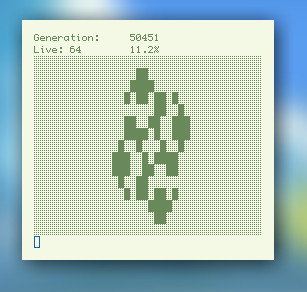
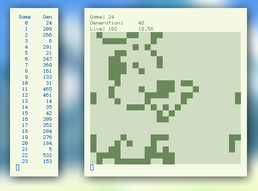

#Conway's Game of Life

Implementation of the popular hit, "Conway's Game of Life"!

##Installation

Just run `make`.

##Usage
From a text file: 
```
./Conway <generations> <speed 1-10> <text file>  
## Example:  
./Conway 200 9 ex/galaxy.txt
```   
Randomly generated:
```
./Conway <generations> <speed 1-10> random <X,Y>  
## Example:  
./Conway 0 10 random 30,15
```
If generations is 0, it will run until killed externally.

####From a text file


####Using a log


###Notes

In the source, there are some important definitions:
```C                      
#define COLORSPEED 14  /* The higher this is, the slower the color changes.
                        * Comment it out to remove color.
                        */

#define LOG 20         /* Stops the game when the field reaches a static
                        * state, writes how many generations it took to reach
                        * in a logfile called log.txt. The amount of games
                        * played and logged is specfied by this constant.
                        * Comment out to neithor log nor stop the inital game.
                        */

#define LOGACCURACY 80 /* The higher this is, the more generations are tested
                        * to determine a static field. Slower, but more
                        * accurate. There is always the possibility of
                        * a glider spawning with nothing but one 2x2 block
                        * on the field. The larger your field, the higher
                        * LOGACCURACY recommended.
                        */

#define LOGFEATHER 4   /* Blinkers may cause a game to never stop. This
                        * constant allows for changes in life within a
                        * certain range while still considering the
                        * field to be static.
                        */

#define BACKGROUND     /* When active, this prevents the games from being
                        * printed, so the program only runs and logs the
                        * results. Much faster than printing them.
                        */
```
